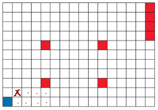
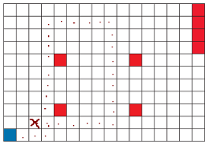

## Bonus Challenge (for myself):
- *Refrain from using strings or vectors* (failed)

## Task 1:
Create a program that wouuld calculate the amount of *'\n'* symbols in a given text.

## Task 2:
Create a program, that would calculate how many words are capitalized in a given text.

## Task 3:
The given text has incorrect placement of spaces, a space before a period, comma, semicolon, exclamation mark, etc. and no spaces after said markings. Create a program, that would fix these errors.

## Task 4:
The first line of a text file, contains the number of students in a class *n*, in *n* other lines, you are given the student's height in centimeters and sex (symbols *'m'* or *'f'*). Between the height and the symbol there is one space. Create a program that would calculate:
- The number of boys and girls in the class;
- The average height for boys and girls;
- The tallest boy and girl.

## Task 5:
A roomba is cleaning a room. It sees the room as a rectangle, divided into squares. A blue square (it's coordinates (0; 0)) marks the place, where the robot rests and recharges. The red squares are obstacles, which the roomba cannot overcome, and thus, has to go around them. The roomba is programmable with commands that are comprised of a single letter and a positive integer.  The commands are as follows: *F* - forward, *B* - back, *L* - left, *R* - right, and the number dictates the amount of squares it must travel.

While moving, the roomba also collects trash and vacuums the carpet if needed. Peter inputs a command sequence. If the roomba cannot complete any given command, it will skip it. Create a program, that would show, where the roomba will execute it's final command.

You are a given a text file. The first line dictates the amount of obstacles *n*, and in *n* subsequent lines, their coordinates (x; y). The final line is the command sequence line, for the roomba to execute.

*Example:*
| in.txt | out.txt | example.png |
| ------ | ------- | ----------- |
| 7 4 2 4 6 10 2 10 6 15 7 15 8 15 9 15 10 R 4 F 5 L 3 | 1 1 | |
| 7 4 2 4 6 10 2 10 6 15 7 15 8 15 9 15 10 R 3 F 9 R 5 B 8 L 6| 2 1 |

## Task 6:
Create a program, which would print out the frequency of each letter that appears in a given text. Uppercase and lowercase should be counted as the same letter. You may use functions like *toupper* and *tolower*, which change the letters acordingly to either uppercase or lowercase. The result must be printed alphabetically. Any letter that does not appear in the text, should not be printed:

*Example:*
| in.txt | out.txt |
| ------ | ------- |
| Lorem ipsum dolor sit amet,  consectetur adipiscing elit, sed  do eiusmod tempor incididunt ut labore et dolore magna aliqua. |A: 7 B: 1 C: 4 D: 8 E: 11 G: 2 I: 11 L: 6 M: 6 N: 5 O: 10 P: 3 Q: 1 R: 6 S: 6 T: 9 U: 6 |

## Task 7:
Create a program, that would calculate any basic mathemetical operation equation. The equation is made up of 2 integers and an arithmatical symbol between them, they are all separated by one space.

*Example:*
| in.txt | out.txt |
| ------ | ------- |
| 15 + 37 | 52 |
| 11 * 11 | 121 |
| 53 / 17 | 3 (2 mod.) |
| 45 - 50 | -5 |

## Task 8:
The Little boy, Carlsen and the house cleaner Frekenbok all love raspberry jam. In the jar, which sits in the kitchen cupboard, are *n* teaspoons of this very delicious jam. The Little boy, having entered the kitchen, steals 2 teaspoons, Carlsen - 5, and Frekenbok -3 teaspoons of jam (if there's any left). In the given text file, the first line contains *n*, the second line contains the amount of visits from the sweet tooths *m*, the third - the order in which they came, written in letters *L*, *C* and *F*. Write a program, that would calculate how many teaspoons of jam will be left, or if there is none left, how many teaspoons of jam did the last person eat.

*Example:*
| in.txt | out.txt |
| ------ | ------- |
| 13 5 LFCCF | 3 Carlsen |
| 13 3 LCF | 3 left |
  
